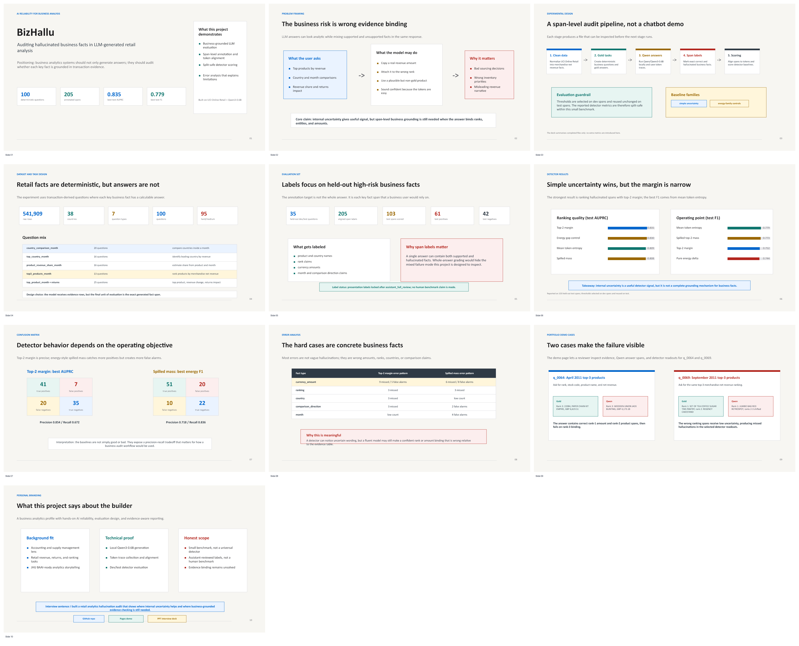

# BizHallu

[Live demo](https://yuchi-wang02.github.io/bizhallu/) |
[Case demo](https://yuchi-wang02.github.io/bizhallu/portfolio_demo.html) |
[Portfolio narrative](https://yuchi-wang02.github.io/bizhallu/portfolio_narrative.html) |
[Presentation deck](https://yuchi-wang02.github.io/bizhallu/assets/bizhallu_ai_reliability_deck.pptx)

BizHallu is a span-level hallucination detection project for LLM-generated
business analysis. It asks whether generated retail analytics claims are
grounded in the underlying transaction evidence.

The project uses UCI Online Retail data, local `Qwen/Qwen3-0.6B` generations,
business-fact span labels, token alignment, and split-safe detector baselines.
It is designed as a business analytics and AI reliability portfolio artifact.



## Why It Matters

Business users do not only need fluent analysis. They need to know whether a
generated claim is supported by the data. BizHallu turns that into an auditable
workflow:

```text
transaction evidence -> deterministic question -> LLM answer -> fact spans -> detector scores -> public demo
```

The evaluation unit is a business fact span, not a whole response. A span can be
a product, country, month, rank, amount, percentage, comparison direction, or
business conclusion.

## Public Artifacts

| Artifact | Link |
| --- | --- |
| GitHub Pages entry | <https://yuchi-wang02.github.io/bizhallu/> |
| Interactive case demo | <https://yuchi-wang02.github.io/bizhallu/portfolio_demo.html> |
| Portfolio narrative | <https://yuchi-wang02.github.io/bizhallu/portfolio_narrative.html> |
| Detector interpretation | <https://yuchi-wang02.github.io/bizhallu/detector_interpretation.html> |
| Interview deck | <https://yuchi-wang02.github.io/bizhallu/assets/bizhallu_ai_reliability_deck.pptx> |

The main demo cases are `q_0064` and `q_0069`. They show Qwen3-0.6B producing
plausible retail analysis while binding real transaction values to the wrong
rank or product.

## Key Results

| Item | Value |
| --- | ---: |
| Deterministic business questions | 100 |
| Question types | 7 |
| Local Qwen3-0.6B generations | 100 |
| Held-out high-priority annotated questions | 35 |
| Aligned business-fact spans | 205 |
| Held-out test spans scored | 103 |
| Best held-out test AUPRC | 0.835 |
| Best held-out test F1 | 0.779 |
| GitHub Pages validation | `num_failures=0` |

Best held-out test AUPRC comes from `one_minus_min_top2_margin`. Best held-out
test F1 comes from `mean_token_entropy`. The strongest energy-family F1 is
0.773 from `mean_spilled_probability_mass_after_top2`.

## What This Shows

- Business analytics framing: the questions and gold answers come from
  transaction evidence, not synthetic facts.
- AI evaluation discipline: generated answers are reviewed at span level, with
  labels, offsets, token alignment, and split-safe metrics.
- Practical limitation: internal uncertainty is useful, but confident wrong
  business bindings can still be missed.
- Portfolio relevance: the final pages and deck explain the work as AI
  reliability for business analysis, not as a generic sales dashboard.

## Repository Map

| Path | Purpose | GitHub status |
| --- | --- | --- |
| `docs/` | GitHub Pages bundle, public pages, public assets | upload |
| `reports/` | Experiment-native HTML reports, summaries, deck | upload |
| `results/` | Detector scores, split metrics, error reviews | upload lightweight files |
| `src/` | Data, generation, annotation, validation, packaging scripts | upload |
| `configs/` | Question and detector run configurations | upload |
| `data/annotations/` | Guidelines and span labels | upload |
| `data/processed/` | Gold-question metadata and small summaries | upload selected lightweight files |
| `outputs/` | README only; large model outputs stay local | do not upload generated outputs |
| `models/` | README only; model weights stay outside git | do not upload weights |

## Detailed Docs

| Document | Purpose |
| --- | --- |
| [`docs/project_blueprint.md`](docs/project_blueprint.md) | Project architecture and workflow overview |
| [`docs/current_state_audit.md`](docs/current_state_audit.md) | Detailed state audit of completed work |
| [`docs/github_upload_checklist.md`](docs/github_upload_checklist.md) | Public upload checklist and claim guardrails |
| [`docs/github_upload_dry_run.md`](docs/github_upload_dry_run.md) | Current GitHub safety and file-inclusion review |

## What Stays Local

The repository intentionally excludes:

- raw Online Retail files under `data/raw/`
- large cleaned line-level transaction tables
- full Qwen generation JSONL files and token traces under `outputs/`
- Hugging Face cache and model weights
- external baseline repositories downloaded for local reference
- local logs and temporary presentation workspaces

This keeps the public repo small while preserving enough code, configuration,
validated reports, and sample artifacts to understand and reproduce the project.

## Reproduce Public Pages

```powershell
python src\build_github_pages_bundle.py
python src\validate_github_pages_bundle.py
python src\build_full100_preflight_report.py
```

Expected state:

- `docs/github_pages_validation.json`: `ready_for_github_pages=true`
- `results/full100_preflight_validation.json`: `current_stage=github_pages_ready`
- both validation files report `num_failures=0`

## Scope

- Labels are locked for presentation with `lock_basis=assistant_full_review`;
  this is not a large independently human-labeled benchmark.
- Metrics should be interpreted at span level, not as whole-answer correctness.
- The detector baselines are diagnostics, not production hallucination
  detection systems.

## License and Data

Project code is released under the MIT License. The raw UCI Online Retail
dataset is not committed; the project keeps derived lightweight artifacts and
documents how to rebuild the public pages from local validated outputs.
