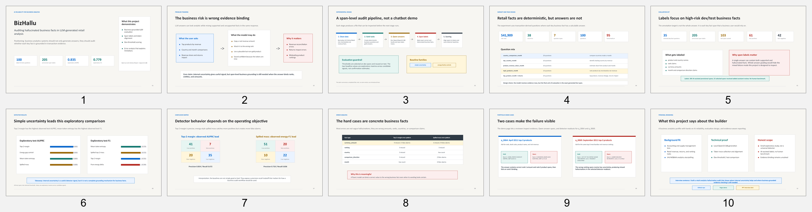

# BizHallu

[Live demo](https://yuchi-wang02.github.io/bizhallu/) |
[Interactive cases](https://yuchi-wang02.github.io/bizhallu/portfolio_demo_v2.html) |
[Methods and results](https://yuchi-wang02.github.io/bizhallu/detector_interpretation.html) |
[Methodology audit](https://yuchi-wang02.github.io/bizhallu/methodology_hardening.html) |
[Confirmation data proof](https://yuchi-wang02.github.io/bizhallu/confirmation_dataset_overlap.html) |
[Research one-pager](https://yuchi-wang02.github.io/bizhallu/research_one_pager.html) |
[Presentation deck](https://yuchi-wang02.github.io/bizhallu/assets/bizhallu_ai_reliability_deck.pptx)

## TL;DR

BizHallu is an AI reliability project for business analytics. It turns retail
transaction evidence into 100 deterministic questions, asks
`Qwen/Qwen3-0.6B` to generate analysis, builds an AI-assisted provisional span
annotation set, aligns pre-identified business-fact spans to token-level traces,
and compares internal-state detector signals.

Across 103 test spans, the highest observed test AUPRC among the candidate
signals was 0.835 and the highest observed test F1 was 0.779. These values come
from different signals. Thresholds were selected on dev spans, but the headline
signal for each metric was selected after comparing test results, so these are
exploratory test-set maxima rather than a preregistered confirmatory estimate.

BizHallu is a span-level hallucination detection project for LLM-generated
business analysis. It asks whether generated retail analytics claims are
grounded in the underlying transaction evidence.

The project uses UCI Online Retail data, local `Qwen/Qwen3-0.6B` generations,
business-fact span labels, token alignment, and split-safe detector baselines.
It is designed as a business analytics and AI reliability portfolio artifact.



## My Role

I designed and implemented the full pipeline: data cleaning, deterministic
question generation, prompt construction, local Qwen generation, the
AI-assisted provisional annotation workflow, token alignment, detector
evaluation, public GitHub Pages packaging, and interview/research-facing
documentation. Fifteen selected demo spans received an additional assistant
review for presentation use; the project does not claim independent human
annotation.

## How to Review This Project in 5 Minutes

1. Open [Demo v2](https://yuchi-wang02.github.io/bizhallu/portfolio_demo_v2.html)
   and inspect `q_0064` or `q_0069`.
2. Read the highlighted presentation labels: supported facts can sit next to
   incorrect rank, product, or amount bindings.
3. Check the detector outcome column to see which internal uncertainty signals
   missed confident wrong business facts.
4. Open the [Methodology audit](https://yuchi-wang02.github.io/bizhallu/methodology_hardening.html)
   to see the sample-selection, split-overlap, annotation, and confirmation-study boundaries.
5. Use [Methods and results](https://yuchi-wang02.github.io/bizhallu/detector_interpretation.html)
   for detector tradeoffs and the [Research one-pager](https://yuchi-wang02.github.io/bizhallu/research_one_pager.html)
   for the next-stage comparison design.

## Reproducibility Levels

- Public review: GitHub Pages, README, reports, summaries, and committed
  lightweight validation artifacts.
- Clean-clone validation: committed public pages and summaries can be checked
  with the standard-library validators used by GitHub Actions.
- Local artifact rebuild: public pages can be regenerated when the excluded
  Qwen outputs, token traces, and experiment reports are available locally.
- Full rerun: Qwen generation requires the raw UCI Online Retail file, local
  model cache, and non-committed token traces.

## Best Use Cases

| Reader | Start with |
| --- | --- |
| Recruiter | [Demo v2](https://yuchi-wang02.github.io/bizhallu/portfolio_demo_v2.html) |
| Professor or research advisor | [Research one-pager](https://yuchi-wang02.github.io/bizhallu/research_one_pager.html) and [methodology audit](https://yuchi-wang02.github.io/bizhallu/methodology_hardening.html) |
| Technical interviewer | [Detector interpretation](https://yuchi-wang02.github.io/bizhallu/detector_interpretation.html) and [methodology audit](https://yuchi-wang02.github.io/bizhallu/methodology_hardening.html) |
| Business interviewer | [Business risk lens](https://yuchi-wang02.github.io/bizhallu/business_risk_lens.html) |

## Why It Matters

Business users do not only need fluent analysis. They need to know whether a
generated claim is supported by the data. BizHallu turns that into an auditable
workflow:

```text
transaction evidence -> deterministic question -> LLM answer -> fact spans -> detector scores -> public demo
```

The evaluation unit is a business fact span, not a whole response. A span can be
a product, country, month, rank, amount, percentage, comparison direction, or
business conclusion.

## Public Artifacts

| Artifact | Link |
| --- | --- |
| GitHub Pages entry | <https://yuchi-wang02.github.io/bizhallu/> |
| Interactive demo v2 | <https://yuchi-wang02.github.io/bizhallu/portfolio_demo_v2.html> |
| Interactive case demo | <https://yuchi-wang02.github.io/bizhallu/portfolio_demo.html> |
| Career package | <https://yuchi-wang02.github.io/bizhallu/career_package.html> |
| Business risk lens | <https://yuchi-wang02.github.io/bizhallu/business_risk_lens.html> |
| Research one-pager | <https://yuchi-wang02.github.io/bizhallu/research_one_pager.html> |
| Methodology Hardening v1 | <https://yuchi-wang02.github.io/bizhallu/methodology_hardening.html> |
| Claim-evidence review schema v0 | <https://yuchi-wang02.github.io/bizhallu/evidence_verifier_pilot.html> |
| Portfolio narrative | <https://yuchi-wang02.github.io/bizhallu/portfolio_narrative.html> |
| Detector interpretation | <https://yuchi-wang02.github.io/bizhallu/detector_interpretation.html> |
| Interview deck | <https://yuchi-wang02.github.io/bizhallu/assets/bizhallu_ai_reliability_deck.pptx> |

The main demo cases are `q_0064` and `q_0069`. They show Qwen3-0.6B producing
plausible retail analysis while binding real transaction values to the wrong
rank or product.

## Key Results

| Item | Value |
| --- | ---: |
| Deterministic business questions | 100 |
| Question types | 7 |
| Local Qwen3-0.6B generations | 100 |
| High-priority dev/test answers in provisional annotation set | 35 of 36 |
| AI-assisted provisional business-fact span labels | 205 |
| Selected spans with additional assistant presentation review | 15 |
| Test spans scored | 103 |
| Exploratory maximum test AUPRC across candidate signals | 0.835 |
| Exploratory maximum test F1 across candidate signals | 0.779 |
| GitHub Pages validation | `num_failures=0` |

The AUPRC maximum comes from `one_minus_min_top2_margin`; the F1 maximum comes
from `mean_token_entropy`. The strongest observed energy-family F1 is 0.773
from `mean_spilled_probability_mass_after_top2`. Because these winners were
identified by comparing test results, the numbers summarize this experiment
and should not be treated as a fresh confirmation-set estimate.

The 35 evaluated answers were selected through a high-priority queue that used
generated-answer auto-status. The split was assigned periodically within each
question type rather than grouped by month or evidence payload. Methodology
Hardening v1 therefore classifies these results as exploratory and conditional
on an error-enriched subset; it also specifies a fresh, context-separated
confirmation protocol.

## What This Shows

- Business analytics framing: the questions and gold answers come from
  transaction evidence, not synthetic facts.
- AI evaluation discipline: generated answers are represented with exact span
  offsets, token alignment, and dev-selected thresholds; public wording keeps
  the provisional label and exploratory model-selection limits visible.
- Practical limitation: internal uncertainty is useful, but confident wrong
  business bindings can still be missed.
- Research extension: Claim-Evidence Review Schema v0 organizes 15 Demo v2
  spans as claim-evidence rows. Its statuses are inherited from the selected
  presentation labels, so it is a protocol scaffold rather than an independent
  verifier result.
- Portfolio relevance: the final pages and deck explain the work as AI
  reliability for business analysis, not as a generic sales dashboard.
- Career relevance: the career package and business risk lens connect the work
  to BA, DS, and AI Analyst interviews across accounting, supply-management,
  and evidence-grounded decision-support use cases.

## Repository Map

| Path | Purpose | GitHub status |
| --- | --- | --- |
| `docs/` | GitHub Pages bundle, public pages, public assets; current public source of truth | upload |
| `reports/` | Experiment-native HTML reports, summaries, deck | upload |
| `results/` | Detector scores, split metrics, error reviews | upload lightweight files |
| `src/` | Data, generation, annotation, validation, packaging scripts | upload |
| `configs/` | Question and detector run configurations | upload |
| `data/annotations/` | Guidelines and span labels | upload |
| `data/processed/` | Gold-question metadata and small summaries | upload selected lightweight files |
| `outputs/` | README only; large model outputs stay local | do not upload generated outputs |
| `models/` | README only; model weights stay outside git | do not upload weights |

## Detailed Docs

| Document | Purpose |
| --- | --- |
| [`docs/project_blueprint.md`](docs/project_blueprint.md) | Project architecture and workflow overview |
| [`docs/current_state_audit.md`](docs/current_state_audit.md) | Detailed state audit of completed work |
| [`docs/evidence_aware_verifier_design.md`](docs/evidence_aware_verifier_design.md) | Next-stage verifier design and research comparison plan |
| [`configs/methodology_protocol_v1.json`](configs/methodology_protocol_v1.json) | Machine-readable boundary between the current exploratory study and a future confirmation study |
| [`configs/confirmation_set_v1_protocol.json`](configs/confirmation_set_v1_protocol.json) | Prospective, context-separated confirmation design with outcome-blind sampling and seven execution gates |
| [`reports/bizhallu_confirmation_dataset_source_audit.html`](reports/bizhallu_confirmation_dataset_source_audit.html) | Candidate-source decision, verified acquisition/structure evidence, and remaining source gates |
| [`reports/bizhallu_confirmation_dataset_quality.html`](reports/bizhallu_confirmation_dataset_quality.html) | Strict-window completeness, grain, cancellation, revenue reconciliation, monthly coverage, and controls |
| [`reports/bizhallu_confirmation_dataset_overlap.html`](reports/bizhallu_confirmation_dataset_overlap.html) | Aggregate-only canonical, date-blind, lineage-calibration, business-pattern, and entity-overlap proof |
| [`reports/bizhallu_confirmation_set_v1_design.html`](reports/bizhallu_confirmation_set_v1_design.html) | Human-readable Confirmation Set v1 design; no new experiment result |
| [`docs/github_upload_checklist.md`](docs/github_upload_checklist.md) | Public upload checklist and claim guardrails |
| [`docs/github_upload_dry_run.md`](docs/github_upload_dry_run.md) | Current GitHub safety and file-inclusion review |

## What Stays Local

The repository intentionally excludes:

- raw Online Retail files under `data/raw/`
- large cleaned line-level transaction tables
- full Qwen generation JSONL files and token traces under `outputs/`
- Hugging Face cache and model weights
- external baseline repositories downloaded for local reference
- local logs and temporary presentation workspaces

This keeps the public repo small while preserving enough code, configuration,
validated reports, and sample artifacts to understand and reproduce the project.

## Validate Committed Public Artifacts

```powershell
python src\validate_public_path_hygiene.py
python src\validate_github_pages_bundle.py
python src\validate_portfolio_demo_v2.py
python src\validate_career_package.py
python src\validate_business_risk_lens.py
python src\validate_research_one_pager.py
python src\validate_evidence_verifier_pilot.py
python src\validate_methodology_hardening.py
python src\validate_confirmation_dataset_acquisition.py
python src\validate_confirmation_dataset_quality.py
python src\validate_confirmation_dataset_overlap.py
python src\validate_confirmation_dataset_source_audit.py
python src\validate_confirmation_set_v1_design.py
```

Expected state:

- `docs/github_pages_validation.json`: `ready_for_github_pages=true`
- `reports/public_path_hygiene_validation.json`: `num_failures=0`
- `reports/bizhallu_evidence_verifier_pilot_validation.json`: `num_failures=0`
- `reports/bizhallu_methodology_hardening_validation.json`: `num_failures=0`
- `reports/bizhallu_confirmation_dataset_quality_validation.json`: `num_failures=0`
- `reports/bizhallu_confirmation_dataset_overlap_validation.json`: `num_failures=0`
- `reports/bizhallu_confirmation_dataset_source_audit_validation.json`: `num_failures=0`
- `reports/bizhallu_confirmation_set_v1_design_validation.json`: `num_failures=0`
- all validation files report `num_failures=0`

The GitHub Actions workflow at `.github/workflows/validate.yml` runs only
lightweight public-artifact checks with the Python standard library. The
`requirements.txt` file remains focused on the full local experiment pipeline,
including Qwen and model-trace dependencies.

## Rebuild From Local Experiment Artifacts

The following commands require excluded local artifacts such as full Qwen
generations, token traces, and intermediate validation reports. They are not a
clean-clone reproduction path.

```powershell
python src\build_evidence_verifier_pilot.py
python src\build_methodology_hardening_report.py
python src\profile_confirmation_dataset_quality.py
python src\build_confirmation_dataset_quality_report.py
python src\profile_confirmation_dataset_overlap.py
python src\build_confirmation_dataset_overlap_report.py
python src\build_confirmation_dataset_source_audit.py
python src\build_confirmation_set_v1_design.py
python src\build_research_one_pager.py
python src\build_github_pages_bundle.py
python src\sanitize_public_json_paths.py
python src\build_full100_preflight_report.py
```

## Scope

- The 205-span annotation set is AI-assisted and provisional. Fifteen selected
  presentation spans received an additional assistant review with
  `lock_basis=assistant_full_review`. No independent human annotation or
  inter-annotator agreement has been completed.
- Metrics should be interpreted at span level, not as whole-answer correctness.
- The current evaluation scores pre-identified business-fact spans; automatic
  claim extraction from new responses is outside the current scope.
- Thresholds are selected on dev spans, but the reported AUPRC/F1 headline
  signals were chosen after test comparison. Treat them as exploratory maxima,
  not confirmatory held-out model-selection estimates.
- The detector baselines are diagnostics, not production hallucination
  detection systems.
- Claim-Evidence Review Schema v0 derives statuses from existing presentation
  labels. It is not an independent verifier, production checker, or new
  benchmark result.
- Confirmation Set v1 is a prospective design, not a completed experiment. Its
  12-question protocol pilot, 30-question development split, and 30-question
  sealed confirmation split are minimum planning targets. The 502,938-row
  strict-window quality profile is complete with documented controls. Canonical
  eight-field and date-blind seven-field comparisons both found zero repeated
  current-source records. Context feasibility, an outcome-blind precision
  review, and all seven execution gates remain pending. This is same-retailer,
  same-lineage temporal separation, not external independence.

## License and Data

Project code is released under the MIT License. The raw dataset is not
committed. Online Retail is provided by the UCI Machine Learning Repository
under CC BY 4.0: Chen, D. (2015), DOI
<https://doi.org/10.24432/C5BW33>. The Qwen model and other external components
remain governed by their own licenses and model cards.
